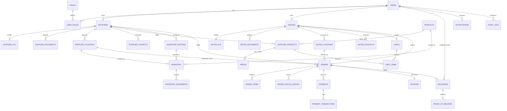

# TheChickenMan Database ERD & Data Dictionary

## 1. Entity-Relationship Diagram

---

## 2. Table Specifications & Constraints

### Identity & Access Control
- `roles`: `id` (INT PK), `name` (VARCHAR unique, e.g. ADMIN, SUPPLIER, BUYER, DRIVER), `description` (TEXT).
- `users`: `id` (UUID PK), `email` (VARCHAR unique), `phone_number` (VARCHAR unique), `password_hash` (VARCHAR), `full_name` (VARCHAR), `is_active` (BOOLEAN), `created_at` (TIMESTAMPTZ), `updated_at` (TIMESTAMPTZ).
- `user_roles`: `user_id` (UUID FK users.id), `role_id` (INT FK roles.id), PK(user_id, role_id).

### Suppliers
- `suppliers`: `id` (UUID PK), `user_id` (UUID FK users.id unique), `business_name` (VARCHAR), `trade_name` (VARCHAR), `kyc_status` (VARCHAR: PENDING, APPROVED, REJECTED, SUSPENDED), `status` (VARCHAR: ACTIVE, INACTIVE), `created_at` (TIMESTAMPTZ), `updated_at` (TIMESTAMPTZ).
- `supplier_kyc`: `id` (UUID PK), `supplier_id` (UUID FK suppliers.id unique), `gstin` (VARCHAR(15)), `pan` (VARCHAR(10)), `fssai_license_number` (VARCHAR(14)), `bank_account_name` (VARCHAR), `bank_account_number` (VARCHAR), `bank_ifsc` (VARCHAR), `bank_name` (VARCHAR), `status` (VARCHAR), `rejection_reason` (TEXT), `verified_by` (UUID FK users.id), `verified_at` (TIMESTAMPTZ).
- `supplier_documents`: `id` (UUID PK), `supplier_id` (UUID FK suppliers.id), `document_type` (VARCHAR: GST_CERTIFICATE, FSSAI_LICENSE, PAN_CARD, CANCELLED_CHEQUE, OTHER), `file_path` (VARCHAR), `file_name` (VARCHAR), `mime_type` (VARCHAR), `file_size` (INT), `uploaded_at` (TIMESTAMPTZ).
- `supplier_locations`: `id` (UUID PK), `supplier_id` (UUID FK suppliers.id), `name` (VARCHAR), `type` (VARCHAR: PLANT, WAREHOUSE, DISPATCH_POINT), `address_line1` (VARCHAR), `address_line2` (VARCHAR), `city` (VARCHAR), `state` (VARCHAR), `pincode` (VARCHAR(6)), `serviceable_pincodes` (JSONB / ARRAY), `is_active` (BOOLEAN).
- `supplier_contacts`: `id` (UUID PK), `supplier_id` (UUID FK suppliers.id), `name` (VARCHAR), `email` (VARCHAR), `phone` (VARCHAR), `designation` (VARCHAR), `is_primary` (BOOLEAN).

### Buyers
- `buyers`: `id` (UUID PK), `user_id` (UUID FK users.id unique), `business_name` (VARCHAR), `buyer_type` (VARCHAR: RETAILER, HOTEL, RESTAURANT, QSR, CATERER, INSTITUTIONAL), `kyc_status` (VARCHAR: PENDING, APPROVED, REJECTED, SUSPENDED), `status` (VARCHAR: ACTIVE, INACTIVE), `created_at` (TIMESTAMPTZ), `updated_at` (TIMESTAMPTZ).
- `buyer_kyc`: `id` (UUID PK), `buyer_id` (UUID FK buyers.id unique), `gstin` (VARCHAR(15)), `pan` (VARCHAR(10)), `fssai_license_number` (VARCHAR(14)), `status` (VARCHAR), `rejection_reason` (TEXT), `verified_by` (UUID FK users.id), `verified_at` (TIMESTAMPTZ).
- `buyer_documents`: `id` (UUID PK), `buyer_id` (UUID FK buyers.id), `document_type` (VARCHAR), `file_path` (VARCHAR), `file_name` (VARCHAR), `mime_type` (VARCHAR), `uploaded_at` (TIMESTAMPTZ).
- `buyer_locations`: `id` (UUID PK), `buyer_id` (UUID FK buyers.id), `name` (VARCHAR), `address_line1` (VARCHAR), `address_line2` (VARCHAR), `city` (VARCHAR), `state` (VARCHAR), `pincode` (VARCHAR(6)), `operating_hours` (VARCHAR), `is_primary` (BOOLEAN), `is_verified` (BOOLEAN).
- `buyer_contacts`: `id` (UUID PK), `buyer_id` (UUID FK buyers.id), `name` (VARCHAR), `email` (VARCHAR), `phone` (VARCHAR), `designation` (VARCHAR), `is_primary` (BOOLEAN).

### Catalogue & Pricing
- `products`: `id` (UUID PK), `sku_code` (VARCHAR unique, e.g. CHK-WHL-FRS-A), `name` (VARCHAR), `product_type` (VARCHAR: WHOLE, CUTS, BONELESS), `condition` (VARCHAR: FRESH, CHILLED, FROZEN), `grade` (VARCHAR: GRADE_A, GRADE_B, STANDARD), `standard_pack_size_kg` (NUMERIC(10,2)), `description` (TEXT), `is_active` (BOOLEAN).
- `supplier_products`: `id` (UUID PK), `supplier_id` (UUID FK suppliers.id), `product_id` (UUID FK products.id), `supplier_sku_code` (VARCHAR), `base_price_per_kg` (NUMERIC(10,2)), `moq_kg` (NUMERIC(10,2)), `lead_time_hours` (INT), `pack_size_kg` (NUMERIC(10,2)), `is_available` (BOOLEAN), `serviceable_pincodes` (JSONB), `created_at` (TIMESTAMPTZ), `updated_at` (TIMESTAMPTZ). Unique(supplier_id, product_id).
- `prices`: `id` (UUID PK), `supplier_product_id` (UUID FK supplier_products.id), `price_per_kg` (NUMERIC(10,2)), `effective_from` (TIMESTAMPTZ), `effective_to` (TIMESTAMPTZ nullable), `buyer_segment` (VARCHAR: ALL, RETAILER, HORECA, INSTITUTIONAL), `moq_kg` (NUMERIC(10,2)), `version` (INT), `created_by` (UUID FK users.id), `created_at` (TIMESTAMPTZ).

### Inventory & Batches
- `inventory_batches`: `id` (UUID PK), `supplier_id` (UUID FK suppliers.id), `batch_number` (VARCHAR), `production_date` (DATE), `expiry_date` (DATE), `storage_condition` (VARCHAR: FRESH, CHILLED, FROZEN), `created_at` (TIMESTAMPTZ).
- `inventory`: `id` (UUID PK), `supplier_id` (UUID FK suppliers.id), `supplier_location_id` (UUID FK supplier_locations.id), `product_id` (UUID FK products.id), `batch_id` (UUID FK inventory_batches.id nullable), `quantity_available_kg` (NUMERIC(12,2) CHECK >= 0), `quantity_reserved_kg` (NUMERIC(12,2) CHECK >= 0), `quantity_allocated_kg` (NUMERIC(12,2) CHECK >= 0), `quantity_dispatched_kg` (NUMERIC(12,2) CHECK >= 0), `quantity_delivered_kg` (NUMERIC(12,2) CHECK >= 0), `quantity_rejected_kg` (NUMERIC(12,2) CHECK >= 0), `quantity_expired_kg` (NUMERIC(12,2) CHECK >= 0), `updated_at` (TIMESTAMPTZ).
- `inventory_movements`: `id` (UUID PK), `inventory_id` (UUID FK inventory.id), `batch_id` (UUID FK inventory_batches.id nullable), `movement_type` (VARCHAR: STOCK_IN, RESERVED, RELEASED, ALLOCATED, DISPATCHED, DELIVERED, REJECTED, EXPIRED, ADJUSTMENT), `quantity_kg` (NUMERIC(12,2)), `reference_order_id` (UUID nullable), `notes` (TEXT), `created_at` (TIMESTAMPTZ), `actor_id` (UUID FK users.id).

### Carts & Orders
- `carts`: `id` (UUID PK), `buyer_id` (UUID FK buyers.id unique), `created_at` (TIMESTAMPTZ), `updated_at` (TIMESTAMPTZ).
- `cart_items`: `id` (UUID PK), `cart_id` (UUID FK carts.id), `supplier_product_id` (UUID FK supplier_products.id), `supplier_location_id` (UUID FK supplier_locations.id), `quantity_kg` (NUMERIC(10,2)), `added_at` (TIMESTAMPTZ).
- `orders`: `id` (UUID PK), `order_number` (VARCHAR unique, e.g. ORD-2026-0001), `buyer_id` (UUID FK buyers.id), `supplier_id` (UUID FK suppliers.id), `supplier_location_id` (UUID FK supplier_locations.id), `delivery_location_id` (UUID FK buyer_locations.id), `status` (VARCHAR: PENDING, CONFIRMED, PROCESSING, PACKED, DISPATCHED, DELIVERED, REJECTED, CANCELLED, REFUNDED), `subtotal_amount` (NUMERIC(12,2)), `tax_amount` (NUMERIC(12,2)), `delivery_fee` (NUMERIC(12,2)), `total_amount` (NUMERIC(12,2)), `delivery_slot_start` (TIMESTAMPTZ), `delivery_slot_end` (TIMESTAMPTZ), `payment_terms` (VARCHAR: ADVANCE, NET_7, NET_15, COD), `notes` (TEXT), `created_at` (TIMESTAMPTZ), `updated_at` (TIMESTAMPTZ).
- `order_items`: `id` (UUID PK), `order_id` (UUID FK orders.id), `product_id` (UUID FK products.id), `supplier_product_id` (UUID FK supplier_products.id), `batch_id` (UUID FK inventory_batches.id nullable), `quantity_kg` (NUMERIC(10,2)), `unit_price_per_kg` (NUMERIC(10,2)), `tax_rate_percent` (NUMERIC(5,2)), `tax_amount` (NUMERIC(10,2)), `total_price` (NUMERIC(12,2)).
- `order_status_history`: `id` (UUID PK), `order_id` (UUID FK orders.id), `previous_status` (VARCHAR), `new_status` (VARCHAR), `changed_by_user_id` (UUID FK users.id), `reason` (TEXT), `created_at` (TIMESTAMPTZ).

### Payments & Invoices
- `payments`: `id` (UUID PK), `order_id` (UUID FK orders.id), `payment_provider` (VARCHAR: MOCK, RAZORPAY, STRIPE), `provider_transaction_id` (VARCHAR nullable), `provider_order_id` (VARCHAR nullable), `amount` (NUMERIC(12,2)), `currency` (VARCHAR(3) DEFAULT 'INR'), `status` (VARCHAR: PENDING, SUCCESS, FAILED, REFUNDED), `idempotency_key` (VARCHAR unique), `payment_method` (VARCHAR), `metadata` (JSONB), `created_at` (TIMESTAMPTZ), `updated_at` (TIMESTAMPTZ).
- `payment_transactions`: `id` (UUID PK), `payment_id` (UUID FK payments.id), `event_type` (VARCHAR), `payload` (JSONB), `status` (VARCHAR), `created_at` (TIMESTAMPTZ).
- `invoices`: `id` (UUID PK), `invoice_number` (VARCHAR unique, e.g. INV-2026-0001), `order_id` (UUID FK orders.id unique), `supplier_id` (UUID FK suppliers.id), `buyer_id` (UUID FK buyers.id), `invoice_date` (DATE), `subtotal` (NUMERIC(12,2)), `cgst_amount` (NUMERIC(12,2)), `sgst_amount` (NUMERIC(12,2)), `igst_amount` (NUMERIC(12,2)), `total_tax` (NUMERIC(12,2)), `grand_total` (NUMERIC(12,2)), `pdf_path` (VARCHAR nullable), `created_at` (TIMESTAMPTZ).

### Logistics & POD
- `deliveries`: `id` (UUID PK), `order_id` (UUID FK orders.id unique), `driver_user_id` (UUID FK users.id nullable), `vehicle_number` (VARCHAR), `status` (VARCHAR: ASSIGNED, PICKED_UP, IN_TRANSIT, DELIVERED, FAILED), `assigned_at` (TIMESTAMPTZ), `delivered_at` (TIMESTAMPTZ nullable), `notes` (TEXT).
- `proof_of_delivery`: `id` (UUID PK), `delivery_id` (UUID FK deliveries.id unique), `pod_type` (VARCHAR: OTP, SIGNATURE, PHOTO), `otp_code_verified` (BOOLEAN DEFAULT FALSE), `recipient_name` (VARCHAR), `signature_url` (VARCHAR nullable), `photo_url` (VARCHAR nullable), `quantity_accepted_kg` (NUMERIC(10,2)), `rejection_reason` (TEXT nullable), `captured_at` (TIMESTAMPTZ), `driver_id` (UUID FK users.id).

### Notifications & Audit
- `notifications`: `id` (UUID PK), `user_id` (UUID FK users.id), `type` (VARCHAR: EMAIL, SMS, WHATSAPP, PUSH), `event` (VARCHAR: ORDER_CONFIRMATION, ORDER_ACCEPTANCE, DISPATCH, DELIVERY, REJECTION, PAYMENT_SUCCESS), `subject` (VARCHAR), `message` (TEXT), `status` (VARCHAR: SENT, FAILED), `created_at` (TIMESTAMPTZ).
- `audit_logs`: `id` (UUID PK), `actor_id` (UUID FK users.id nullable), `action` (VARCHAR), `entity_type` (VARCHAR), `entity_id` (VARCHAR), `old_values` (JSONB nullable), `new_values` (JSONB nullable), `ip_address` (VARCHAR nullable), `user_agent` (VARCHAR nullable), `created_at` (TIMESTAMPTZ).
