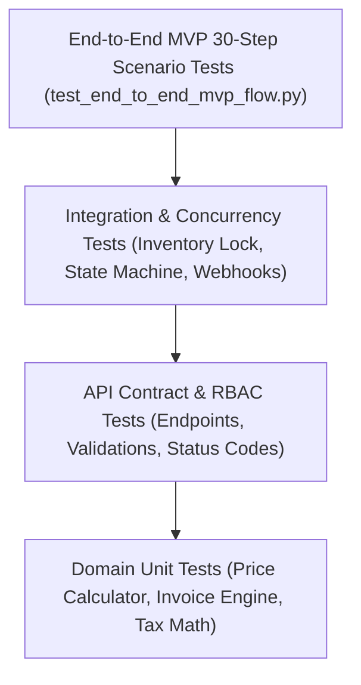

# TheChickenMan: Quality Assurance (QA) Strategy & Test Plan

## 1. Quality Objectives
TheChickenMan platform handles physical perishable poultry inventory, financial transactions, and multi-tenant commercial operations. The QA strategy ensures:
1. **Zero Overselling**: Concurrent orders for scarce batch inventory cannot exceed available quantity under any race condition.
2. **Deterministic State Machine**: Orders cannot skip lifecycle states or transition without proper authority and audit trails.
3. **Strict KYC Gatekeeping**: Unverified suppliers cannot list products for sale; unverified buyers cannot place orders.
4. **Idempotent Financial Operations**: Duplicate payment webhooks or network retries must never double-bill or create redundant orders/payments.
5. **Accurate Tax & Invoice Calculations**: Proper GST rates (CGST/SGST vs IGST) are applied based on place of supply.

---

## 2. Test Pyramid & Automation Suite

---

## 3. Dedicated Test Modules

| Test Suite File | Scope & Target Capabilities |
| :--- | :--- |
| `backend/tests/test_auth.py` | Registration, login, password hashing, JWT issue/validation, RBAC restrictions across Admin, Supplier, Buyer, Driver. |
| `backend/tests/test_kyc_workflow.py` | Supplier & buyer KYC submission, document upload, Admin approval/rejection/suspension, audit trail logging. |
| `backend/tests/test_catalogue_pricing.py` | Standard chicken SKU creation, supplier product listing, price versioning, MOQ validation, landed price computation. |
| `backend/tests/test_inventory_concurrency.py` | Multithreaded/asynchronous concurrent order placement attempting to reserve identical batch stock; verifies pessimistic locking (`SELECT FOR UPDATE`) prevents overselling. |
| `backend/tests/test_order_state_machine.py` | Order placement, supplier acceptance, partial acceptance with allocation recalculation, packing, dispatch, delivery, cancellation, rejection; invalid transition rejection. |
| `backend/tests/test_payments_idempotency.py` | Payment intent creation, mock provider callback, webhook processing, signature validation, duplicate webhook replay idempotency. |
| `backend/tests/test_invoice_generation.py` | GST invoice generation with sequential numbering, intrastate CGST+SGST vs interstate IGST calculation, order linkage. |
| `backend/tests/test_logistics_pod.py` | Driver assignment, transit status updates, proof of delivery (POD) capture with OTP, digital signature, accepted vs rejected weight, delivered state trigger. |
| `backend/tests/test_end_to_end_mvp_flow.py` | Complete end-to-end 30-step lifecycle test as specified in the project roadmap. |

---

## 4. Concurrency Testing Methodology
- **Scenario**: A supplier has exactly 100 kg of Whole Broiler Grade A in Batch #BAT-001.
- **Action**: Ten simultaneous buyer checkout requests are issued concurrently via `asyncio.gather` / worker threads, each requesting 25 kg (Total requested = 250 kg).
- **Expected Result**: Exactly 4 requests succeed (reserving 100 kg total). Exactly 6 requests fail with `409 Conflict` or `400 Bad Request` citing stock exhaustion.
- **Integrity Check**: Available stock equals 0 kg, reserved stock equals 100 kg, and exactly 4 `RESERVED` inventory movement records exist.
